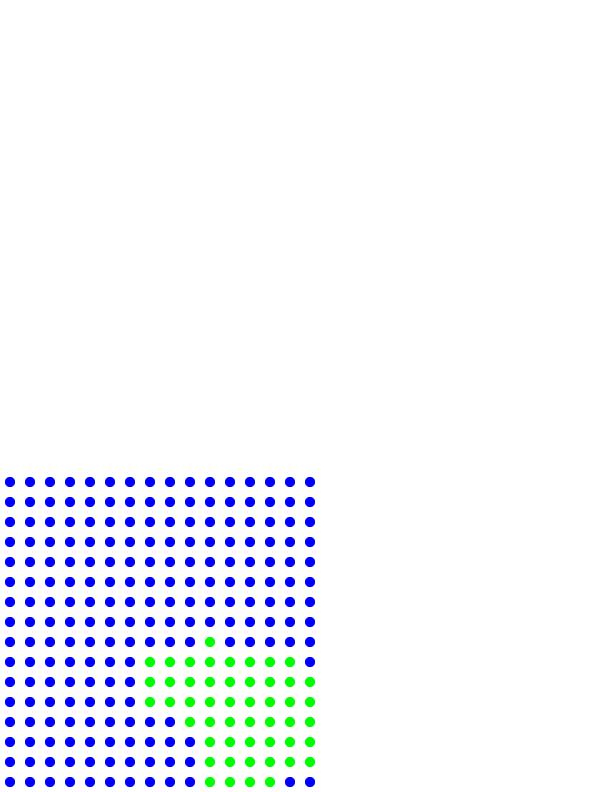
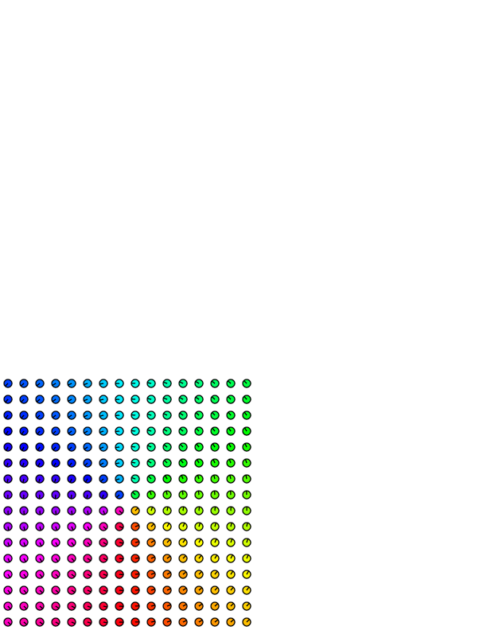

==================================================
スピン系のクラスターアルゴリズムについての私的覚書
==================================================

:Author: 渡辺宙志

.. role:: raw-latex(raw)
   :format: latex
..

はじめに
========

このノートは、渡辺がスピン系のクラスターアルゴリズムの理解、実装につまずいた経験をまとめたものである。
特に実装していて「あれ？ボンドをつなぐ確率は\ :math:`1 - \mathrm{e}^{-\beta}`\ だっけ、それとも
:math:`1 - \mathrm{e}^{-2\beta}`\ だっけ？」と迷うことがあったので、そんな場合にきちんと分配関数の変形から導けるようになることを目的としている。
専門家ではないので、内容の正確さについては保証できない。

マルコフ連鎖モンテカルロ法
==========================

相互作用が一様な強磁性イジング模型を考える。
ハミルトニアンは以下の通り。

.. math:: H = -J \sum_{\left<i, j\right>} \sigma_i \sigma_j

右辺第一項は相互作用項であり、和は相互作用する隣接スピン間でとる。
以下、系の全てのスピンの状態を一つ決めた状態を\ :math:`\left\{ \sigma_i \right\}`\ と略記し、
スピン状態と呼ぶ。分配関数は以下のようになる。

.. math::

   \begin{aligned}
     Z &=& \sum_{\{\sigma_i\}} \exp\left(\beta \sum_{\left<i, j\right>} \sigma_i \sigma_j \right) \label{eq_Z}
   \end{aligned}

ただし、\ :math:`\beta \equiv J/(k_B T)`\ であり、最初の和は全てのスピン状態について取ることを意味している。
スピン変数\ :math:`\sigma_i`\ は1か-1の値を取るものとする。
全てのスピン状態について和を取れば分配関数は厳密に求められるが、スピンの数が増えるごとに
状態数が指数関数的に増加するため、現実的には実行できない。
そこで、モンテカルロ法で何かの物理量\ :math:`A`\ を計算することを考える。
モンテカルロ法では、なんらかの確率的な方法により、スピン状態\ :math:`\left\{\sigma_i  \right\}`\ が、
ボルツマン重み\ :math:`\exp\left( \beta H(\left\{\sigma_i  \right\})\right)`\ に比例して出現するようにして、
その上で物理量\ :math:`A`\ の期待値を計算する、という手続きを踏む。

このとき、全くランダムにスピン状態を生成し、それらをボルツマン重みをつけて
平均を取っても原理的には物理量の期待値は求まるが、全体の状態数に比べ、物理量に寄与する状態数は極端に少ないため、
極めて効率が悪くなる、
そこで、ある状態\ :math:`\left\{\sigma_i  \right\}`\ から、別の状態\ :math:`\left\{\sigma_i  \right\}'`\ を
特定の方法で次々と作り出すことで、最終的にボルツマン重みに比例して状態を出現させる方法が
マルコフ連鎖モンテカルロ法(Markov-Chain Monte Carlo, MCMC
method)である。
新しいスピン状態の作り方は、詳細釣り合いを満たしていればどのような作り方をしても良いが [1]_、多くの場合はMetropolis法か熱浴法が用いられる。

あるスピン\ :math:`i`\ に着目し、他のスピンを全て固定した状態において、
スピン\ :math:`i`\ が上向きである重みと下向きである重みを考える。
その重みに従い、現在の状態を考慮しフリップするかどうかを確率的に決めるのが
Metropolis法、現在の状態に関係なく、新しい状態を決めるのが熱浴法である。
いずれにせよ、一度の操作で変更されるスピンは一つだけであり、Single-Spin-Flipなどと呼ばれる。
スピン\ :math:`i`\ の状態が変わると、当然ながらスピン\ :math:`i`\ と相互作用しているスピンの重みが変わる。
従って、スピン\ :math:`i`\ の更新が終了するまでは、次のスピンの更新ができない。
これは、スピンが間接的に全て相互作用していることから来る制約であるから、
なんらかの形でスピンの相互作用を切って、独立な塊に分けてしまえば、
一度に多数のスピンを更新できるのではないか、そのような方法を実現するのが
クラスターアルゴリズムである。

ボンド変数の導入
================

分配関数(`[eq_Z] <#eq_Z>`__)を以下のように変形する。まず、指数関数の中の和を外に出して積にする。

.. math::

   \begin{aligned}
     Z &=& \sum_{\{\sigma_i\}} \exp\left(\beta \sum_{\left<i, j\right>} \sigma_i \sigma_j \right) \\
     &=&  \sum_{\{\sigma_i\}} \prod_{\left<i, j\right>}  \exp\left(\beta \sigma_i \sigma_j \right)
   \end{aligned}

重み\ :math:`\exp (\beta \sigma_i \sigma_j)`\ は、二つのスピン変数の値(スピンの向き)が等しい時と異なるときで異なるので、
クロネッカーのデルタを用いて次のように書き直せる。

.. math::

   \begin{aligned}
     \exp (\beta \sigma_i \sigma_j) &=& \mathrm{e}^{-\beta} + \delta_{\sigma_i, \sigma_j} \left( \mathrm{e}^{\beta} - \mathrm{e}^{-\beta}  \right)   \\
     &=&  \mathrm{e}^{\beta} \left[\mathrm{e}^{-2\beta}  +  \delta_{\sigma_i, \sigma_j}(1 - \mathrm{e}^{-2\beta}) \right] \\
     &=& \mathrm{e}^{\beta} \left[(1-p) +  p \delta_{\sigma_i, \sigma_j} \right]
   \end{aligned}

ここで\ :math:`p \equiv 1 - \mathrm{e}^{-2 \beta}`\ である。
さらに、\ :math:`0`\ または\ :math:`1`\ の値を取る変数\ :math:`b_{ij}`\ を導入し、
クロネッカーのデルタに関する恒等式

.. math:: x + y = \sum_b^{0,1} x \delta_{b,0} + y \delta_{b,1}

を用いて書き直すと、

.. math::

   \exp (\beta \sigma_i \sigma_j) =
     \sum_{b_{ij}}  \mathrm{e}^{\beta} \left[(1-p) \delta_{b_{ij},0} +  p \delta_{\sigma_i, \sigma_j} \delta_{b_{ij},1} \right]

となる。 最終的に分配関数は以下の形に書きなおされる [2]_。

.. math:: Z =  \sum_{\{\sigma_i\}} \sum_{\{b_{ij}\}}  \prod_{\left<i, j\right>}   \mathrm{e}^{\beta} \left[(1-p) \delta_{b_{ij},0} +  p \delta_{\sigma_i, \sigma_j} \delta_{b_{ij},1} \right]

ここで、新たに導入された変数\ :math:`b_{ij}`\ を、スピン\ :math:`i`\ とスピン\ :math:`j`\ を結ぶボンドが「接続されている状態(active)」
であるか、「接続されていない状態(inactive)」であるかを示す、ボンドに住む変数であると解釈する。
すると、もともと系の自由度はスピンだけであったが、新たにボンドという自由度が導入されたことになる。
クラスターアルゴリズムとは、スピン変数とボンド変数を交互に更新するアルゴリズムである。

もう少しボンド変数の意味を考察しよう。本質的には\ :math:`x + y`\ の形に書かれたボルツマン重みに対し、
:math:`x \delta_{b,0}+ y \delta_{b,1}`\ と変形することで、
inactive(:math:`b=0`)なら\ :math:`x`\ を、active(:math:`b=1`)なら\ :math:`y`\ を選択する新たな自由度\ :math:`b`\ を導入している。
:math:`b`\ について和を取れば\ :math:`x + y`\ に戻るため、この変形自体は等価変形である。
ここで、inactiveの際に選ばれる重み\ :math:`x`\ に、スピン変数の自由度が含まれないように取る。
これは、ボンド変数がinactiveであるときには、相互作用エネルギー\ :math:`J`\ がゼロになったと解釈して良い。
相互作用エネルギーがゼロであるのだから、そのボンドの相互作用は「切れて」おり、
その両端にあるスピンは、お互いの向きが自分のボルツマン重みに直接影響を与えなくなる。
従って、切れたボンドにより「孤立した」クラスタは、まわりの影響を考慮せずに自由に更新して良いことになる。
こうして、新たにボンド変数を導入することで、相互作用を「切る」ことがクラスターアルゴリズムのキモである。

Swendsen-Wangアルゴリズム
=========================

まず、あるスピン状態が与えられ、固定されたとしよう。その状態でボンド変数をボルツマン重みに従って更新することを考える。
スピン\ :math:`i`\ とスピン\ :math:`j`\ を結ぶボンドに関する重みは以下の通り。

.. math:: S_{ij} = \mathrm{e}^{\beta} \left[(1-p) \delta_{b_{ij},0} +  p \delta_{\sigma_i, \sigma_j} \delta_{b_{ij},1} \right]

ボンドの両端のスピンがそろっていない場合、重みは以下のようになる。

.. math:: S_{ij}= \mathrm{e}^{\beta} (1-p) \delta_{b_{ij},0}

これは、両端のスピンが揃っていない時には、ボンドがactiveである(:math:`b_{ij}=1`)である重みはゼロであることを意味する。
従って、両端のスピンがそろっていなければ、ボンドは常にinactiveでなければならない。

次に、ボンドの両端のスピンが揃っている場合には、重みは以下のようになる。

.. math:: S_{ij}= \mathrm{e}^{\beta} \left[(1-p) \delta_{b_{ij},0} +  p \delta_{b_{ij},1} \right]

これは、ボンドがactiveである重みが\ :math:`p`\ 、inactiveである重みが\ :math:`1-p`\ に比例することを意味する。
従って、ボンド両端のスピンが揃っている場合、ボンド変数は確率\ :math:`p`\ でactive、確率\ :math:`1-p`\ でinactiveにすれば良い。
これは、スピン状態が固定された条件下において、ボンド変数を熱浴法にて更新したことになっている。
熱浴法であるから、過去のボンド状態に関係なく、新たな状態を与える。
ここで重要なことは、ボンド変数はお互いに相互作用をしていない、ということである。
ボンド変数の重みは両端のスピン状態によってのみ決まり、あるボンド変数の状態が変わっても、別のボンド変数の重みを変えない。従って、全てのボンド変数はお互いを気にすることなく、両端のスピン状態により与えられた局所的な重みにのみ従って新たな状態を与えることができる。この手続きを全てのボンドについて実行することで、あるスピン状態において、新たなボンド状態が作られる。

次に、先に与えられたボンド状態を固定し、スピン状態を更新することを考える。
ボンド\ :math:`ij`\ に関する重みは以下のとおり。

.. math:: S_{ij} = \mathrm{e}^{\beta} \left[(1-p) \delta_{b_{ij},0} +  p \delta_{\sigma_i, \sigma_j} \delta_{b_{ij},1} \right]

ボンド変数\ :math:`b_{ij}`\ がinactiveである場合(:math:`b_{ij}=0`)には、重みは以下のようになる。

.. math:: S_{ij} = \mathrm{e}^{\beta} (1-p)

この重みにはスピン変数\ :math:`\sigma_i`\ が含まれていない。これは、ボンドが切れているスピン同士は独立であることを意味する。
従って、activeなボンドでつながったスピン全てを反転させても、ボルツマン重みの値は変わらない。
ボルツマン重みが等しい二つの状態を熱浴法で更新する場合、それぞれ\ :math:`1/2`\ の確率で選べば良い。
以上から、「activeなボンドでつながったスピンの塊(activeボンドの定義から全て同じ向きを向いている)を、
確率\ :math:`1/2`\ で全て上向きか下向きにすれば良い。
ボンドが繋がっていない、独立したスピンクラスタは、お互いに影響を与えないので、それぞれ独立に新しい
スピン状態を与えて良い。

まとめると、クラスターアルゴリズムは以下のような手順となっている。

#. 「ボンド状態の更新」
   隣り合うスピンが同じ向きである場合、そのボンドを確率\ :math:`p \equiv 1 - \mathrm{e}^{-2 \beta}`\ で
   activeにする。それ以外のボンドは全てinactiveにする。

#. 「クラスタリング」
   activeなボンドでつながったスピンをクラスタとしてまとめる。activeなボンドをもっていないスピンはそれで一つのクラスタとみなす。

#. 「スピン状態の更新」それぞれのクラスタごとに独立して新たなスピン状態を与える。イジングモデルであれば、確率\ :math:`1/2`\ で上向きか下向きかを与える。

#. 以上を繰り返す

以上の手続きをSwendsen-Wangアルゴリズムと呼ぶ:raw-latex:`\cite{SW}`。
それぞれ、ボンド状態の更新時はスピン状態を固定し、スピン状態を更新するときにはボンド状態を固定しているのがポイントである。
変形された分配関数はもとのモデルの分配関数と等価であるから、実現されるスピン状態はもとのモデルと同じボルツマン重みに従う。
また、有限温度である場合には、スピンを全て繋がない(ボンドが全てinactiveになる)確率が存在する。
この時、全てのスピンが独立に新たな値を取るため、全ての状態に遷移する可能性があり、エルゴード性も満たされている。

Wolffアルゴリズム
=================

Wolffアルゴリズム:raw-latex:`\cite{Wolff}`は、もともとSwendsen-Wangアルゴリズムの連続スピン系への拡張として提案されたが、
実は離散スピン系の更新アルゴリズムもSwendsen-Wangアルゴリズムと異なっている。
ここでは、まずイジング模型にWolffアルゴリズムを適用する方法を説明する。

Swendsen-Wangアルゴリズムでは、ボンド状態もスピン状態も熱浴法で更新する。
そこで、スピン状態だけMetropolisで更新することを考える。
まず、ボンド状態の更新が終わり、スピンがクラスタにわかれた状態とする。
Metropolis法では、同じ重みを持つ状態間の遷移確率は100%である。すなわち、
あるスピンの上向きと下向きのボルツマン重みが同じだった場合、そのスピンが選ばれたら
Metropolis法なら必ず向きを反転する。
Swendsen-Wangでは、全てのスピンのクラスタについて新たな状態を与えたが、
それをMetropolisでやると、全てのスピンを反転するだけになり意味がない。
そこで、クラスタを一つだけ選び、そのクラスタのスピンを反転することを考えよう。
手順は以下のようになる。

#. 「ボンド状態の更新」
   隣り合うスピンが同じ向きである場合、そのボンドを確率\ :math:`p \equiv 1 - \mathrm{e}^{-2 \beta}`\ で
   activeにする。それ以外のボンドは全てinactiveにする。

#. 「クラスタリング」
   activeなボンドでつながったスピンをクラスタとしてまとめる。activeなボンドをもっていないスピンはそれで一つのクラスタとみなす(ここまではSwendsen-Wangと同じ)。

#. 「スピン状態の更新」更新するクラスターを、その体積(クラスタに含まれるスピン数)に比例して選び、選ばれたクラスタに含まれるスピンを全て反転する。

#. 以上を繰り返す

さて、このアルゴリズムには無駄が多いので、改良することを考えよう。
まず、「体積に比例してクラスタを選ぶ」手続きについては、単純に「系の中のスピンを一つ任意に選び、そのスピンを含むクラスタが選ばれたとする」とすれば良い。このようにすれば、クラスタが選ばれる確率が体積に比例することは自明であろう。

次に、選ばれたクラスタしか操作しないため、それ以外のボンド変数の情報は不要である。
そこで、選ばれたクラスタのボンド情報のみ与えることを考える。
具体的には、以下のような手続きになろう。

#. スピンを一つ、一様に選ぶ(:math:`N`\ 個のスピンを含む系であれば、確率\ :math:`1/N`\ で選ぶ)。

#. そのスピンにつながるボンド全てについて、隣接するスピンが揃っていればボンドを確率\ :math:`p`\ でactiveに、
   そうでなければボンドをinactiveにする。

#. activeになったボンドの先にあるスピンについて、同じ操作を繰り返す。ただし、すでに
   activeかinactiveか判定がなされたボンドについては除外する。

#. 以上の操作を再帰的に繰り返し、activeなボンドで接続されたスピンクラスタがこれ以上成長しなくなったら(クラスタの境界にあるボンドが全て判定済みになったら)手続きを終了し、完成したクラスタに含まれるスピンを全て反転する

Swendsen-WangでもWolffでも「ボンド状態を更新し、その後にスピン状態を更新する」という手続きは同じであるが、
Swengsen-Wangは全てのボンド状態を更新するのに対し、Wolffは必要なボンド状態のみ更新する点、
およびSwendsen-Wangはスピン状態の更新が熱浴法であるのに対し、
WolffはMetropolisを用いている点が異なる。逆に言えば、違いはその点だけで、
本質的な点はどちらも変わらない。

その他の系でのクラスターアルゴリズム
====================================

Q-状態 Potts模型
----------------

Q-状態強磁性Potts模型を考える。スピン変数は\ :math:`\sigma_i`\ とし、\ :math:`0`\ から\ :math:`Q-1`\ までの値を取るものとしよう。
相互作用エネルギーは、隣り合うスピンが同じであれば\ :math:`-J`\ 、異なる場合は\ :math:`0`\ としよう。
するとハミルトニアンは以下の様に表される。

.. math:: H = -J \sum_{\left<i,j\right>} \delta_{\sigma_i,\sigma_j}

イジング模型の場合と同様に、分配関数を変形してボンド変数を導入しよう。

.. math::

   \begin{aligned}
     Z &=& \sum_{\{\sigma_i\}} \exp\left(\beta \sum_{\left<i,j\right>} \delta_{\sigma_i,\sigma_j} \right)\\
     &=& \sum_{\{\sigma_i\}} \prod_{\left<i,j\right>}  \exp\left(\beta \delta_{\sigma_i,\sigma_j} \right)\\
     &=& \sum_{\{\sigma_i\}} \prod_{\left<i,j\right>} \left[  \delta_{\sigma_i,\sigma_j} (\mathrm{e}^{\beta} -1) +1 \right] \\
     &=& \sum_{\{\sigma_i\}} \prod_{\left<i,j\right>} \mathrm{e}^{\beta} \left[  \delta_{\sigma_i,\sigma_j} (1 - \mathrm{e}^{-\beta}) +\mathrm{e}^{-\beta} \right] \\
     &=& \sum_{\{\sigma_i\}}  \prod_{\left<i,j\right>} \mathrm{e}^{\beta} \left[  p \delta_{\sigma_i,\sigma_j} + (1-p)\right] \qquad  (p \equiv 1 - \mathrm{e}^{-\beta}) \\
     &=& \sum_{\{\sigma_i\}} \sum_{\{b_{ij}\}}  \prod_{\left<i,j\right>} \mathrm{e}^{\beta} \left[  p \delta_{\sigma_i,\sigma_j}  \delta_{b_{ij},1}  + (1-p)  \delta_{b_{ij},0} \right]
   \end{aligned}

ここから、イジング模型の場合と全く同様に、隣接するスピン変数の値が同じである場合には
確率\ :math:`p \equiv 1 - \mathrm{e}^{-\beta}`\ でボンドをactiveに、それ以外ではボンドをinactiveにして、
activeなボンドでつながっている同じクラスタのスピン変数の値を\ :math:`0`\ から\ :math:`Q-1`\ から一様に選べば良いことがわかる。
同様に、イジング模型においても、スピン変数を\ :math:`\sigma_i = \{-1,1\}`\ ではなく\ :math:`\sigma_i = \{0,1\}`\ としている場合には、
ボンドをつなぐ確率を\ :math:`p \equiv 1 - \mathrm{e}^{-\beta}`\ とすれば良い。

相互作用が非一様なイジング模型
------------------------------

クラスターアルゴリズムを連続スピン系に適用する準備として、相互作用の強さ\ :math:`J`\ がボンドによって
異なる模型を考える。スピン\ :math:`i`\ とスピン\ :math:`j`\ をつなぐボンドの相互作用を\ :math:`J_{ij}`\ とすると、
ハミルトニアンは以下のように表される。

.. math:: H = - \sum_{\left<i, j\right>} J_{ij} \sigma_i \sigma_j

あとは相互作用が一様な場合と全く同様にボンド変数\ :math:`b_{ij}`\ を導入し、分配関数を変形すると、

.. math:: Z =  \sum_{\{\sigma_i\}} \sum_{\{b_{ij}\}}  \prod_{\left<i, j\right>}   \mathrm{e}^{\beta_{ij}} \left[(1-p_{ij}) \delta_{b_{ij},0} +  p_{ij} \delta_{\sigma_i, \sigma_j} \delta_{b_{ij},1} \right]

となる。ただし、\ :math:`\beta_{ij} \equiv J_{ij}/k_B T`\ および\ :math:`p_{ij} \equiv 1 - \exp(-2 \beta_{ij})`\ である。
すなわち、ボンドの接続確率として、これまでは一様な確率\ :math:`p`\ を使っていたのに対し、
ボンドの相互作用に応じて異なる確率\ :math:`p_{ij}`\ を使えばよい。

連続スピン系
------------

スピン変数\ :math:`\mathbf{\sigma}_i`\ がベクトル量であり、その内積によりエネルギーが与えられるハミルトニアンを考える。

.. math:: H = -J \sum_{\left<i, j\right>}  \mathbf{\sigma}_i \cdot \mathbf{\sigma}_j

さて、一般の向きをもった単位ベクトル\ :math:`\mathbf{r}`\ を考え、そのベクトルに平行な成分と垂直な成分に
スピンを分解する。

.. math:: \mathbf{\sigma}_i = \mathbf{\sigma}_i^\parallel + \mathbf{\sigma}_i^\perp

ただし

.. math:: \mathbf{\sigma}_i^\parallel \equiv (\mathbf{\sigma}_i \cdot \mathbf{r}) \mathbf{r}

である。
新しいイジング型変数\ :math:`\va.pngilon_i \equiv \mathrm{sign}(\mathbf{\sigma}_i \cdot \mathbf{r})`\ を用いると、

.. math:: \mathbf{\sigma}_i =  \va.pngilon_i |\mathbf{\sigma}_i \cdot \mathbf{r}| +  \mathbf{\sigma}_i^\perp

であるから、

.. math:: \mathbf{\sigma}_i \cdot \mathbf{\sigma}_j  =  |\mathbf{\sigma}_i \cdot \mathbf{r}|  |\mathbf{\sigma}_j \cdot \mathbf{r}|  \va.pngilon_i  \va.pngilon_j + \mathbf{\sigma}_i^\perp \cdot \mathbf{\sigma}_j^\perp

これをハミルトニアンに代入すると、

.. math:: H = -J \sum_{\left<i, j\right>}   |\mathbf{\sigma}_i \cdot \mathbf{r}|  |\mathbf{\sigma}_j \cdot \mathbf{r}|  \va.pngilon_i  \va.pngilon_j  -J \sum_{\left<i, j\right>} \mathbf{\sigma}_i^\perp \cdot \mathbf{\sigma}_j^\perp \label{eq_wolff}

さて、ここでスピンの\ :math:`\mathbf{r}`\ に関して垂直な成分を固定し、平行な成分のみを自由度だと思うことにする。
すると、ハミルトニアン(`[eq_wolff] <#eq_wolff>`__)の右辺第二項は定数となる。
さらに\ :math:`J_{ij} \equiv J  |\mathbf{\sigma}_i \cdot \mathbf{r}|  |\mathbf{\sigma}_j \cdot \mathbf{r}|`\ と定義すると、

.. math:: H = -\sum_{\left<i, j\right>} J_{ij}\va.pngilon_i  \va.pngilon_j  + \mathrm{const.}

となる。これは相互作用が非一様なイジング模型に等価であるから、これまでと同様に
クラスターアルゴリズムが適用できる。
ただしエルゴード性を満たすために、毎回射影軸\ :math:`\mathbf{r}`\ の方向を取り直さなければならない。
射影軸を用いてイジング化したスピン系に、Swendsen-Wangアルゴリズムを適用した場合の
手続きは以下の通り。

#. 射影軸\ :math:`\mathbf{r}`\ を選ぶ。ただし\ :math:`\mathbf{r}`\ は任意の方向を向いた単位ベクトルである。

#. イジング型変数\ :math:`\va.pngilon_i \equiv \mathrm{sign}(\mathbf{\sigma}_i \cdot \mathbf{r})`\ を計算し、
   隣り合うイジングスピン変数が同じ符号である場合(:math:`\va.pngilon_i \va.pngilon_j = 1`)である場合に [3]_、
   確率\ :math:`p = 1 - \exp(-2 \beta_{ij})`\ でボンドをactiveにする。ただし、\ :math:`\beta_{ij} \equiv J_{ij}/k_B T`\ 、
   :math:`J_{ij} \equiv J  |\mathbf{\sigma}_i \cdot \mathbf{r}|  |\mathbf{\sigma}_j \cdot \mathbf{r}|`\ とする。

#. active なボンドでつながったスピンをクラスタとしてまとめる。

#. それぞれのクラスタごとに独立して新たなイジングスピン変数\ :math:`\va.pngilon'_i`\ を与える。
   すなわち、新たなスピン変数\ :math:`\mathbf{\sigma}'_i`\ は、
   :math:`\mathbf{\sigma}'_i =  \va.pngilon'_i |\mathbf{\sigma}_i \cdot \mathbf{r}| + \mathbf{\sigma}_i^\perp`
   で与える。

#. 以上を繰り返す。

全く同様にしてWolffアルゴリズムも適用できる。
射影軸を用いてイジング化した模型にSwendsen-Wangアルゴリズムを適用する方法をWolff-Swendsen-Wangアルゴリズムと呼ぶことがある。

有限温度の場合には、全てのボンドがinactiveになる確率が有限であり、
さらに射影軸\ :math:`\mathbf{r}`\ を毎回任意に取ることで、各スピン変数は任意の向きを取る可能性があるため、
エルゴード性が満たされている。
ボンド変数が熱浴法、スピン変数が熱浴法ないしMetropolis法で更新されていることで、
詳細釣り合い条件についても同様に満たされていることはすぐに理解できよう。

クラスターアルゴリズムによる加速
================================

クラスターアルゴリズムがなぜ早いか、ということについて
「できあがるクラスターのサイズが相関長程度であり、その相関長の及ぶ範囲をまるごと更新できるから」
という説明がなされることがある。これは正しいのかもしれないが、クラスターアルゴリズムが早いのは、
単に「一度にたくさんスピンを更新できるから」では無い。
もし一度にたくさんスピンを更新できることが早い理由であれば、Single-Spin-Flipでも、総数として
同等の数のスピンを更新すれば同じ程度に緩和させることができるように思えるが、
実際にはそうなっておらず、クラスターアルゴリズムは緩和を劇的に加速することがわかっている。
その加速についていくつかの例を挙げてみる。

Potts模型におけるドメインウォールの解消
---------------------------------------

正方格子上の4状態Potts模型を考える。初期状態として図\ `1 <#fig_initial>`__\ のように、
各状態がかたまった状態を考えよう。それぞれの「同じスピン状態のかたまり」をドメインと呼び、
異なるドメイン間の境界をドメインウォールと呼ぶ。
この状態から、Single-Spin-Flipによる更新と、
クラスターアルゴリズムによる更新の様子を観察する。システムサイズは\ :math:`16 \times 16`\ で、
周期境界条件を課す。逆温度は\ :math:`\beta = 3.0`\ と、低温に設定する。この温度では
基底状態は強磁性状態であるため、十分系が緩和すれば全てのスピンが同じ状態になるはずである。
しかし、強磁性状態に緩和するためにはドメインウォールを解消しなければならない。

図\ `[fig_single] <#fig_single>`__\ に、Single-Spin-Flipによる時間発展を示す。
更新ルールにはMetropolis法を用いた。スピンを順番に更新していき、
系の全てのスピンについて試行が終了した段階を1 Monte Carlo Step
(MCs)と定義する。
:math:`16 \times 16`\ という比較的小さい系であっても、このようなドメインウォールを
解消するのにはおよそ600MCs必要であった。これは大きなサイズになればなるほど時間がかかる。
同様な理由から、完全無秩序状態(全てのスピンの値が乱数で与えられた状態)から緩和させた場合も、
最終的にドメインウォールが成長するため、その解消に時間がかかる。

図\ `[fig_single] <#fig_single>`__\ に、クラスターアルゴリズムによる時間発展を示す。
更新ルールにはSwendsen-Wangを用いた。ボンド状態を更新し、クラスタリングし、そしてクラスタごとに
新しい状態を与えるところまでを1 MCsと定義した。
系は4MCsでほぼ緩和した。無論、緩和に必要な計算時間もSingle-Spin-Flipよりも圧倒的に短い。
低温であるため、同じ状態を持つスピンをつなぐボンドは、高い確率でactiveとなる。
すると、それぞれのドメインはひとつのクラスタとなり、新しい状態が1/4で選ばれる。
隣のドメインと同じ状態が選ばれた場合、そのドメインはつながり、新たなドメインとなる。
一度「大きなドメイン」となったドメインがまた分割される確率は低く、
すぐに系全体がひとつのドメインとなる。
すなわち、\ **クラスターアルゴリズムはドメインウォールを選択的に解消する性質を持っている**\ 。
これが「クラスターアルゴリズムがSingle-Spin-Flipよりも本質的に早い」理由の一つだと思われる。

.. container:: center

   .. figure:: sw00.png
      :alt: 初期状態。4状態Potts模型のスピンの状態がそれぞれ別の色で示されている。
      :name: fig_initial

      初期状態。4状態Potts模型のスピンの状態がそれぞれ別の色で示されている。

.. container:: center

   |image| |image1| |image2| |image3|

.. container:: center

   |image4| |image5| |image6| |image7|

古典XY模型における渦の解消
--------------------------

二次元古典連続スピン系、例えば古典XY模型においては、渦のダイナミクスが重要な役割を果たす。
低温においては渦のダイナミクスが極めて遅くなり、系の緩和を支配する。
図\ `[fig_xy] <#fig_xy>`__\ の左に、中央に渦を一つ持つ初期状態を示す。
Potts模型におけるドメインウォールと同様に、
低温において、Single-Spin-Flipでこの渦を解消するのには極めて時間がかかる。
しかし、図\ `[fig_xy] <#fig_xy>`__\ 右に示したように、ある射影軸をとってスピン変数をイジング様変数に落として
ボンド変数を更新すると、イジング変数が同じ値、すなわち射影軸から見て同じ向きであるスピンが
繋がれる。その後、左右のクラスタは独立に更新されるため、渦が破壊される。
すなわち、\ **連続スピン系におけるクラスターアルゴリズムは渦を選択的に破壊する**\ 。
系の緩和を支配していた渦を選択的に破壊するのであるから、系の緩和が劇的に早くなるであろうことは理解できよう。

.. container:: center

   |image8| |image9|

終わりに
========

クラスターアルゴリズムの説明においては、「隣り合うスピンをつないで・・・」という形で語られる事が多い。
これは、ボンド変数という新たな自由度を導入したことがわかりづらく、僕がクラスターアルゴリズムを理解する障害となっていた。クラスターアルゴリズムにおいては、ボンド変数という自由度を導入し、「スピン状態を固定してボンド状態を更新」
「ボンド状態を固定してスピン状態を更新」と、系の自由度を部分的に固定することで、更新しようとする自由度の結合を切っていることが本質である(と僕は理解した)。
また、なぜSwendsen-Wangは確率1/2でクラスターをひっくり返し、Wolffでは必ずひっくり返すのかも理解できなかったが、
これはそれぞれ熱浴法とMetropolis法であると思えばすっきり理解できる。
どちらも根本にあるのは「統計的に同じ重みを持つ状態間の遷移」に帰着させ、同じ重みであるから遷移確率を計算する必要がない(熱浴法なら確率1/2で遷移、Metropolisであれば必ず遷移)、というのが本質である。
また、クラスターアルゴリズムがSingle-Spin-Flipよりも早い理由はさほど自明ではないと思われる。
クラスターアルゴリズムは、系の中で一番遅い緩和モードを支配する構造を選択的に解消、破壊することがあり、
その場合には劇的に緩和が早くなる。もちろん系によっては緩和モードがクラスターアルゴリズムの影響を受けづらいことがあり、その場合にはクラスターアルゴリズムによる飛躍的な加速は望めない。
このノートがクラスターアルゴリズムの理解の助けになれば幸いである。

本ノートの執筆にあたり、Prof. W.
Jankeの講義ノート:raw-latex:`\cite{JankeNote}`、川島直輝先生及び川島研の皆様との議論を参考にさせていただきました。皆様に感謝いたします。
なお、本ノートの誤りがある場合は、それは全て渡辺の責任によるものです。

.. container:: thebibliography

   | 9 J.-S. Wang and R. H. Swendsen, Cluster Monte Carlo algorithms,
     Physica A 167:565 (1990). U. Wolff, Collective Monte Carlo Updating
     for Spin Systems, Physical Review Letters **62** 361 (1989). W.
     Janke, Monte Carlo Simulations of Spin Systems,
   | http://www.physik.uni-leipzig.de/j̃anke/Paper/spinmc.pdf

.. [1]
   詳細釣合条件は十分条件であるので、この条件を弱めることでより効率的にサンプリングする手法も存在する。

.. [2]
   ここで、ボンド変数に関する和\ \ :math:`\sum_{b_{ij}}`\ \ と、相互作用ボンドに関する積\ \ :math:`\prod_{\left<i,j \right>}`\ \ を入れ替えていることに注意。ここでは入れ替えても結果は変わらない。

.. [3]
   実際にはいちいちイジング様変数を計算せずとも\ \ :math:`(\mathbf{\sigma}_i \cdot \mathbf{r})\cdot (\mathbf{\sigma}_j \cdot \mathbf{r})`\ \ の符号をチェックするだけで良い。

.. |image4| image:: sw01.png
.. |image5| image:: sw02.png
.. |image6| image:: sw03.png
.. |image7| image:: sw04.png

.. |image9| image:: xy_sw.png
